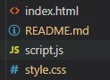

# Code Quiz

## Description

This app uses moment.js library to track time of hourly tasks in a day planner. The app uses local storage for persistance. 

[Click here to the view the deployed website on github-pages](https://mohamedzakigithub.github.io/homework-week5-day-planner/)

## Table of Contents

- [App demo](#App-demo)
- [Files](#Files)
- [HTML](#HTML)
- [Style](#Style)
- [JavaScript](#JavaScript)


## App demo


## Files

The app consists of three files (index.html, style.css, script.js), The html file holds the page layout and main components of text inputs and buttons. The app uses Bootstrap for styling with a custom style sheet to add extra styling. The script.js file contains the app logic.



## HTML

The html file has 9 divs representing the time block for each hour each in a separate row. The div contains a text input field to capture and display notes and a save button element. Each element has a data-index attribute to be used as an index for time identification.

```html
<!-- The following section contains rows corresponding to the 9 hours of the working day, each containing columns 
with time, text input and save button. data-index attribute is set to each text area and button to be used as an 
identifier while selecting the element in jquery -->
      
<div class="row time-block no-gutters">
  <div class="col-1"><P class="hour py-3">09:00 AM</P></div>
  <div class="col-10"><textarea class="description w-100 h-100" data-index="09:00 AM"></textarea></div>
  <div class="col-1 saveBtn " style="position: relative;" data-index="09:00 AM"><i  class="far fa-save"></i></div>
</div>
```

## Style

The app uses Bootstrap 4 for styling as well as a custom style sheet to indivedually color code each time block according to its time state using the following classes. 

```css
.past {
  background-color: #d3d3d3;
  color: black;
}

.present {
  background-color: #ff6961;
  color: black;
}

.future {
  background-color: #77dd77;
  color: black;
}
```

## JavaScript

The script.js file holds the app logic which is checking the current time using the moment.js library and compare it to each time block frame then set the class on this frame to color code the frame. The app has functionality to save the notes using local storage for persistance. 

```javascript
// Select time blocks DOM elements using class (description).

var timeBlockElements = $(".description");

// Attempt to load tasks object from local storage or assign it to an empty object if no locally stored version found.

var tasks = JSON.parse(localStorage.getItem("tasks")) || {};

// Populate time blocks values from the locally stored object if there is a stored value for each time block.

timeBlockElements.each(function(i) {
  var dataIndex = $(timeBlockElements[i]).attr("data-index");
  if (tasks[dataIndex]) {
    $(timeBlockElements[i]).val(tasks[dataIndex]);
  }
});

// Call the renderTable function on page load.

renderTable();

// Set a timer and assign the renderTable function as a call back function to be called every minute to ensure correct color
// representation of each time block in real time.

var interval = setInterval(renderTable, 60000);

// The renderTable function is responsible for displaying the current date on the top of the page and setting the class 
// which formats the color of the time block representing it's current time state compared to the current time.
// This is done by clearing the classes then adding the class which represents the time block status now from 
// ( past, present and future). This is achieved by creating a moment.js object representing the current time then 
// creating a new moment.js object representing the time assigned to the time block which is stored in the data-index 
// attribute, then passing those two objects to the checkTime object that returns the class name to be added to the element.

function renderTable() {
  var currentDate = moment().format("dddd, MMMM Do") // Get current date. 
  var currentTime = moment().format("hh:mm A") ; // Get current time.
  var TimeNow = moment();
  $("#currentDay").text("Date: "+currentDate+" Time: "+currentTime); // Display current date and time.
  timeBlockElements.each(function(i) {
    var dataIndex = $(timeBlockElements[i]).attr("data-index");
    var timeBlock = moment(dataIndex, "HH-mm a");
    $(timeBlockElements[i]).removeClass("past present future");
    $(timeBlockElements[i]).addClass(checkTime(timeBlock, TimeNow));
  });
}

// The checkTime function is called by the renderTable function on each text input element.
// The function compares two moment.js objects by using the duration() method chained with asHours() method
// to return the time difference in hours between the two objects. The function then uses a switch case statement to return
// either (past, present or future).

function checkTime(time1, time2) {
  var timeDiff = moment.duration(time2.diff(time1)).asHours();
  switch (true) {
    case timeDiff > 1:
      return "past";
      break;
    case timeDiff > 0 && timeDiff <= 1:
      return "present";
      break;
    case timeDiff <= 0:
      return "future";
      break;
  }
}

// Click Event handler of the save button assigned to each time block containing a callback function that sets the key and
// the data of the tasks object by capturing the text input value corresponding to the button's data-index attribute
// and then writes the object to local storage.

$(".saveBtn").on("click", function() {
  key = $(this).attr("data-index");
  data = $('.description[data-index="' + key + '"]').val();
  tasks[key] = data;
  localStorage.setItem("tasks", JSON.stringify(tasks));
});

```